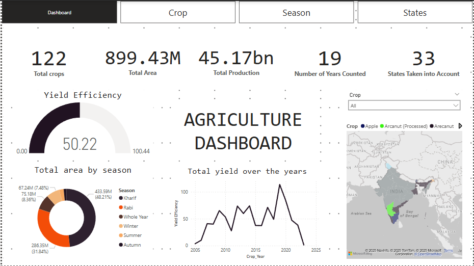
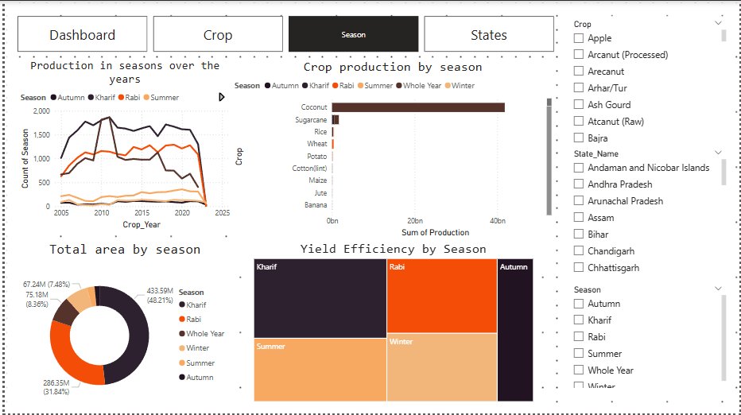

# 🌱 Exhaustive analysis of Indian Agriculture using Power BI

## 🍃 Introduction

This is a part of my project for Edunet Foundation internship on AI / Green Tech Development. I was asked to prepare an interactive dashboard on Indian Agriculture, analysing its aspects, using a tool called Power BI [a great data presentation tool!]. And here we are!

### ✍🏻 Tools used

- Power BI : For presenting analytics in a neat way
- Excel : Format for data set

## 🕵️‍♂️ What did we learn?

### 🌏 States

**Top 5 Producing States :** Kerala, Tamil Nadu, Andhra Pradesh, Uttar Pradesh, Assam

**Top 5 States By Area :** Uttar Pradesh, Maharashtra, Madhya Pradesh, Rajasthan, West Bengal

### 🥥 Crops
#### Most Grown Crop
- **Whole Year :** Coconut
- **Kharif :** Sugarcane
- **Rabi :** Oilseeds
- **Winter, Summer, Autumn:** Rice

#### Least Grown Crop
- **Whole Year :** Apple
- **Kharif :** Arhar / Tur
- **Rabi :** Bajra
- **Summer :** Horsegram
- **Autumn and Winter :** Maize

- Rice and Wheat dominate in terms of area, followed by cotton, gram and mustard.
- Uttar Pradesh and Punjab dominate in both Rice and Wheat production.

### 🌸 Seasons
- **Most Area :** Kharif and Winter crops took up the most area each season.
- **Most Yield Efficient :** Rabi and Summer crops had the most yield efficiency per season.

#### Year where most production occurred for each season
- Summer : 2013
- Kharif : 2010
- Autumn : 2014
- Rabi : 2015
- Winter : 2015
- Whole year : 2017

## Screenshots

